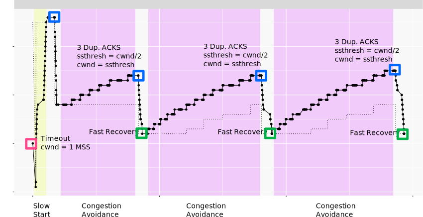

TCP congestion control experiments
=========


This experiment shows the basic behavior of TCP congestion control. You'll see the classic "sawtooth" pattern in a TCP flow's congestion window, and you'll see how a TCP flow responds to congestion indicators.

It should take about 1 hour to run this experiment.

You will run these experiments on FABRIC.

#### FABRIC instructions: Prerequisites

To run this experiment on [FABRIC](https://fabric-testbed.net/?ref=witestlab.poly.edu), you should have a FABRIC account and be part of a FABRIC project.


## Run the experiment

First, reserve a topology including two end hosts, and a router between them. The router will buffer traffic between the sender and the receiver. If the buffer in the router becomes full, it will drop packets, triggering TCP congestion control behavior.

Follow the instructions for the testbed you are using (FABRIC) to reserve the resources and log in to each of the hosts in this experiment.

#### FABRIC instructions: Reserve resources

To run this experiment on FABRIC, open the JupyterHub environment on FABRIC, open a shell, and run

(TODO git links)


Then, open the notebook titled "lab1.ipynb".

Follow along inside the notebook to reserve resources and get the login details for each host and router in the experiment.

When you have logged in to each node, continue to the next section.

### Using `ss` to observe TCP socket statistics

The parameters of the TCP congestion control algorithm, such as congestion window and slow start threshold, are _not_ included in any packet header, since these are used only on the sender side. Therefore, we can't see the details of the congestion control by monitoring packets in `tcpdump` or other packet capture tools.

Instead, we will use `ss`, a linux utility used to monitor local sockets and display socket statistics. In this section, we'll see what the `ss` output looks like, and what useful information it includes.

On the "juliet" host, set up an `iperf3` server with

```
iperf3 -s  -1
```

On the "romeo" host, initiate a connection to the `iperf3` server on "juliet" and send data using TCP Reno congestion control, for 60 seconds, with

```
iperf3 -c juliet -t 60 -C reno
```

While `iperf3` is still sending traffic, open another SSH session on "romeo" and run

```
ss -ein dst 10.10.2.100
```

Here, we use `ss` with some key arguments:

*   `-e` to show detailed socket information
*   `-i` to show internal TCP information. This information is known only to the operating system at the sender side; it is not sent over the network or otherwise shared with the receiver.
*   `-n` specifies that it should not try to resolve names, but should show numeric values (i.e. IP addresses and not hostnames)
*   `dst 10.10.2.100` is a filter that says it should only show sockets with the remote address 10.10.2.100 (the address of "juliet")

You can learn more about `ss` arguments with `man ss` or by visiting the online [man page](https://linux.die.net/man/8/ss?ref=witestlab.poly.edu).

The output of this command will look something like this, although the exact details will vary:

```
Netid     State      Recv-Q      Send-Q            Local Address:Port             Peer Address:Port                                                                                                               
tcp       ESTAB      0           343176              10.10.1.100:49112             10.10.2.100:5201       timer:(on,1.204ms,0) uid:20001 ino:386735 sk:3b <->
     ts sack reno wscale:7,7 rto:1212 rtt:833.978/7.108 mss:1448 pmtu:1500 rcvmss:536 advmss:1448 cwnd:66 ssthresh:35 bytes_acked:589374 segs_out:557 segs_in:273 data_segs_out:555 send 916.7Kbps lastsnd:8 lastrcv:5016 lastack:8 pacing_rate 1.2Mbps delivery_rate 942.8Kbps busy:4972ms rwnd_limited:96ms(1.9%) unacked:71 retrans:2/76 lost:2 sacked:5 rcv_space:14480 rcv_ssthresh:64088 notsent:240368 minrtt:0.483
tcp       ESTAB      0           0                   10.10.1.100:49110             10.10.2.100:5201       uid:20001 ino:386734 sk:3c <->
     ts sack cubic wscale:7,7 rto:208 rtt:5.598/9.458 ato:40 mss:1448 pmtu:1500 rcvmss:536 advmss:1448 cwnd:10 bytes_acked:144 bytes_received:4 segs_out:8 segs_in:7 data_segs_out:3 data_segs_in:3 send 20.7Mbps lastsnd:5020 lastrcv:4972 lastack:4972 pacing_rate 41.4Mbps delivery_rate 9.2Mbps busy:48ms rcv_space:14480 rcv_ssthresh:64088 minrtt:0.723
```

We have two TCP sockets with the specified destination address. One is a socket used to share `iperf3` control information with the receiver. The other is a socket that carries the actual data between the sender and receiver. You can tell which one is which by looking at the `data_segs_out` value - the control flow only sends a few data segments, but the data flow will transfer hundreds or thousands of segments. In this case, the first lines in the `ss` output show the data flow, and the last lines show the control flow.

Also note that the data flow uses TCP Reno, as we specified in the `iperf3` arguments. The control flow uses whatever congestion control is the system default - here, it's TCP Cubic.

After running the command on your end, paste the output in the worksheet.

In the `ss` output for the data flow, see if you can find the following and note them down in the worksheet:

*   the current CWND of this flow. This is shown in units of MSS.
*   the slow start threshold of this flow. This is shown in units of MSS. The slow start threshold field, `ssthresh`, will only appear in the `ss` output once the flow has entered the congestion avoidance phase.
*   the number of retransmitted segments. This will only appear in the `ss` output once there has been a retransmission in the lifetime of the flow. If it appears in the output, it will show two values: the number of currently unacknowledged retransmitted segments, and the total (cumulative) number of retransmissions for the flow.

### Generating data

Next, we will generate some TCP flows between the two end hosts, and use it to observe the behavior of the TCP congestion control algorithm.

While the TCP flows are running, we will also run a script that repeatedly runs `ss` and redirects the output to a file. When you press Ctrl+C, it will stop running the `ss` command and process the raw output into a format that is more convenient for data analysis and visualization.

Download this script on the "romeo" host with

```
wget -O ss-output.sh https://raw.githubusercontent.com/ffund/tcp-ip-essentials/cloudlab/scripts/ss-output.sh
```

On the "juliet" host, run

```
iperf3 -s -1
```

In a terminal on the "romeo" host, run

```
bash ss-output.sh 10.10.2.100
```

In a second terminal on the "romeo" host, run

```
iperf3 -c juliet -P 3 -t 60 -C reno
```

Here

*   `-t 60` says to run for 60 seconds
*   `-c juliet` says to send traffic to the host named "juliet"
*   `-P 3` says to send 3 parallel TCP flows
*   `-C reno` says to use TCP Reno for the data flows

While `iperf3` is running, you will see periodic updates in the `iperf3` window, and a continuous flow of socket statistics data in the `ss` window. After about a minute, you will see a final status report in the `iperf3` window, and the `iperf3` process will finish. Then, use Ctrl+C to stop the `ss` script in the other window. Pressing Ctrl+C once will cause the script to process the raw data, and then exit.

If you run `ls` on the "romeo" host, you should see two files generated by the `ss` script:

*   `sender-ss.txt` is the raw output - the complete output of the `ss` command each time it was executed by the script.
*   `sender-ss.csv` is a processed output - the script parsed the raw output, for each line of output, it prints the following comma-separated columns, in order, for each row of output:
*   Timestamp (in [Unix time](https://en.wikipedia.org/wiki/Unix_time?ref=witestlab.poly.edu) format)
*   TCP sender, in IP:Port format. Each of the TCP flows in this experiment will use a different local port number, and the control flow will use a unique local port number as well. We'll use this field to distinguish the flows.
*   Number of currently unacknowledged retransmissions for this flow.
*   Cumulative number of retransmissions for this flow.
*   Current CWND of this flow.
*   Current slow start threshold of this flow.
*   Current smoothed RTT of this flow in ms.

#### FABRIC-specific instructions: Data visualization

If you are running this experiment on FABRIC, you can use the "Exercise: Data visualization" section of the "setup.ipynb" notebook to transfer the `sender-ss.csv` file from the host to the Jupyter environment and visualize the results.

Then, you can skip to the **Notes** section.

### Visualization

You can use your preferred data visualization tool or programming language to analyze the results of your experiment. (Make sure to exclude the control flow from your analysis!) For convenience, I share a Python script here.

You can retrieve the `sender-ss.csv` data to your laptop, and run the Python script on your laptop. Or you can open a Python terminal on "romeo" by running

```
python3
```

then copy the script below into this terminal and hit Enter to make sure it runs completely. Type exit() and hit Enter to exit the Python terminal. It will have generated an image file named `sender-ss.png`, which you can transfer to your laptop with `scp`.

```python
import pandas as pd
import matplotlib.pyplot as plt

df = pd.read_csv("sender-ss.csv", names=['time', 'sender', 'retx_unacked', 'retx_cum', 'cwnd', 'ssthresh', 'rtt'])

# exclude the "control" flow
s = df.groupby('sender').size()
df_filtered = df[df.groupby("sender")['sender'].transform('size') > 100]

senders = df_filtered.sender.unique()

time_min = df_filtered.time.min()
cwnd_max = 1.1*df_filtered.cwnd.max()
dfs = [df_filtered[df_filtered.sender==senders[i]] for i in range(3)]

fig, axs = plt.subplots(len(senders), sharex=True, figsize=(12,8))
fig.suptitle('CWND over time')
for i in range(len(senders)):
    if i==len(senders)-1:
        axs[i].plot(dfs[i]['time']-time_min, dfs[i]['cwnd'], label="cwnd")
        axs[i].plot(dfs[i]['time']-time_min, dfs[i]['ssthresh'], label="ssthresh")
        axs[i].set_ylim([0,cwnd_max])
        axs[i].set_xlabel("Time (s)");
    else:
        axs[i].plot(dfs[i]['time']-time_min, dfs[i]['cwnd'])
        axs[i].plot(dfs[i]['time']-time_min, dfs[i]['ssthresh'])
        axs[i].set_ylim([0,cwnd_max])


plt.tight_layout();
fig.legend(loc='upper right', ncol=2);

plt.savefig("sender-ss.png")
```

At the beginning of each flow, it operates in slow start mode, where the congestion window increases exponentially. When a congestion event occurs, as indicated by the receipt of multiple duplicate ACKs, the slow start threshold is set to half of the current CWND, and then the CWND is reduces to the slow start threshold.

We'll often see packet losses occur at the same time in multiple flows sharing a bottleneck (as in the figure above), because when the buffer is full, new packets arriving from all flows are dropped.

## Notes

### Exercise

Create a plot of the congestion window size and slow start threshold for each TCP flow over the duration of the experiment, similar to Figure 1 in the [Results](#results) section.

Annotate your plot, similar to Figure 2 in the [Results](#results) section, to show:

*   Periods of "Slow Start"
*   Periods of "Congestion Avoidance"
*   Instances where multiple duplicate ACKs were received (which will trigger "fast recovery")
*   Instances of timeout (if any)

In the worksheet, using your plot and/or experiment data, explain how the behavior of TCP is different in the "Slow Start" and "Congestion Avoidance" phases. Also, using your plot, explain what happens to both the congestion window and the slow start threshold when multiple duplicate ACKs are received.

### Additional exercises: other congestion control algorithms

In the decades since TCP Reno was first proposed, several other congestion control algorithms have been developed that offer improved performance in some circumstances.

You can repeat this experiment with other congestion control variants by changing the value of the `-C` argument in `iperf3`.

First, make sure to save the data from the main part of this experiment. When you run the experiment again (with a different control control algorithm), it will overwrite your previous data, so you want to have that safely stored somewhere else first.

For example, you could run this experiment with TCP Cubic, which is the current default on Linux servers that power much of the Internet. The main difference between TCP Reno and TCP Cubic is the window increase function. While Reno uses the traditional linear increase (W=W+1), Cubic implements a binary search increase which can reach the available bandwidth much faster than Reno. You may read more about Cubic in the [TCP Cubic paper](https://www.cs.princeton.edu/courses/archive/fall16/cos561/papers/Cubic08.pdf?ref=witestlab.poly.edu).

To run the experiment with TCP Cubic, you would repeat the steps in the [Generating Data](#generatingdata) section above, but with the `iperf3` command

```
iperf3 -c juliet -P 3 -t 60 -C cubic

```

on "romeo".

The results will look something like this:


Experiment results for TCP CUBIC.

Notice that unlike Reno, the window size does not increase as a linear function of the time since the last congestion event! Instead, the window size is a cubic function of the time since the last congestion event.

### Additional exercises: low delay congestion control

While TCP CUBIC and Reno are designed with the goal of high throughput, they tend to cause high queuing delays in the network, because they reduce their CWND only when they experience a packet loss, i.e. when the queue is full. A full queue means long queuing delays for packets that traverse the queue!

Some congestion control variants use delay as a signal of congestion, and reduce their sending rate when the delay increases (indicating that the queue is becoming full). An early example is TCP Vegas. You can see this for yourself with a simple experiment to measure the queuing delay with a loss-based congestion control (like Reno or Cubic) and with a delay-based congestion control (Vegas).

For this experiment we will use `iperf3` and `ping` at the same time - `iperf3` to generate a TCP flow, and `ping` to estimate the queuing delay induced by the TCP flow. Run

*   on juliet: `iperf3 -s -1`
*   on romeo terminal 1: `bash ss-output.sh 10.10.2.100`
*   on romeo terminal 2: `iperf3 -c juliet -t 60 -C reno`
*   on romeo terminal 3: `ping juliet -c 50`

(the `ping` should both start and finish while the `iperf3` sender is still running). When it finishes, use Ctrl+C to stop the `ss-output` script. Make a note of the `iperf3` throughput and the round trip time estimated by `ping` during the TCP Reno flow and write this down in the worksheet.

Plot the CWND and slow start threshold, along with the RTT of this flow, using the following Python script:

```python
import pandas as pd
import matplotlib.pyplot as plt

df = pd.read_csv("sender-ss.csv", names=['time', 'sender', 'retx_unacked', 'retx_cum', 'cwnd', 'ssthresh', 'rtt'])

# exclude the "control" flow
s = df.groupby('sender').size()
df_filtered = df[df.groupby("sender")['sender'].transform('size') > 100]
time_min = df_filtered.time.min()

fig, axs = plt.subplots(2, sharex=True, figsize=(8,6))

axs[0].plot(df_filtered['time']-time_min, df_filtered['cwnd'], label="cwnd")
axs[0].plot(df_filtered['time']-time_min, df_filtered['ssthresh'], label="ssthresh")
axs[0].set_ylim([0,150])

axs[1].plot(df_filtered['time']-time_min, df_filtered['rtt'], label="rtt", color='purple')
axs[1].set_ylim([0, 1000])
axs[1].set_xlabel("Time (s)");

plt.tight_layout();
fig.legend(loc='upper right', ncol=2);

plt.savefig("cwnd-rtt.png")
```

and save the `cwnd-rtt.png` figure on your laptop.

Then, repeat with Vegas, the delay-based congestion control algorithm. On romeo, run

```
sudo modprobe tcp_vegas
sudo sysctl -w net.ipv4.tcp_allowed_congestion_control="reno cubic vegas"
```

then, run

*   on juliet: `iperf3 -s -1`
*   on romeo terminal 1: `bash ss-output.sh 10.10.2.100`
*   on romeo terminal 2: `iperf3 -c juliet -t 60 -C vegas`
*   on romeo terminal 3: `ping juliet -c 50`

When it finishes, use Ctrl+C to stop the `ss-output` script. Make a note of the `iperf3` throughput and the round trip time estimated by `ping` during the TCP Vegas flow.

One problem with TCP Vegas is that it does not work well when it shares a bottleneck link with a TCP Reno flow (or other loss-based flow). To see how this works, we will send two TCP flows through the bottleneck router: one TCP Reno flow, and one TCP Vegas flow.

We will need two `iperf3` servers running on juliet, on two different ports. In one terminal on juliet, run

```
iperf3 -s -1
```

to start an `iperf3` server on the default port 5201, and in a second terminal on juliet, run

```
iperf3 -s -1 -p 5301
```

to start an `iperf3` server on port 5301.

You'll need two terminal windows on romeo. In one of them, run

```
iperf3 -c juliet -t 60 -C vegas
```

and a few seconds afterwards, in the second, run

```
iperf3 -c juliet -t 60 -C reno -p 5301
```

Make a note of the throughput reported by `iperf3` for each flow and note it down in the worksheet.

Once you are done with this exercise, take a moment to think about the "fairness" between the users if they are using different protocols. Note down your thoughts in the worksheet.

### Additional exercises: TCP BBR

A more recent congestion control proposed by Google, called TCP BBR, tries to maximize throughput and at the same time minimize queuing delay in the network. You can read more about it in the [TCP BBR paper](https://research.google/pubs/pub45646/?ref=witestlab.poly.edu).

To use the BBR congestion control for your experiment, on romeo, run

```
sudo modprobe tcp_bbr
sudo sysctl -w net.ipv4.tcp_allowed_congestion_control="reno cubic vegas bbr"
```

This will load the Linux kernel module for TCP BBR.

Then, repeat the other steps in the [Generating Data](#generatingdata) section above, but with the `iperf3` command

```
iperf3 -c juliet -P 3 -t 60 -C bbr

```

on "romeo".

BBR doesn't use a slow start threshold, so you won't be able to use the same data visualization script (which assumes that there will be an `ssthresh` field in the data), but you can create a similar plot on your own. The results will look something like this:


Experiment results for TCP BBR.

Note that BBR overall maintains a lower CWND than Cubic or Reno, because it wants to minimize queue occupancy. But you'll see in the `iperf3` output that it still achieves a similar throughput (about 1Mbps total shared between the 3 flows). Also, if you look at the raw `ss` data for the BBR and the Reno/Cubic flows, you'll note that the BBR flows see a much lower RTT, since they do not fill the queue.

### Additional exercises: Explicit congestion notification (ECN)

Finally, we'll try an experiment with explicit congestion notification. Explicit congestion notification (ECN) is a feature that allows routers to explicitly signal to a TCP sender when there is congestion. This allows the sender to reduce its congestion window _before_ the router is forced to drop packets, reducing retransmissions. It can also help the router maintain a minimal queue, which reduces queuing delay.

ECN involves both layer 2 and layer 3, and it requires support from both transport layer endpoints (sender _and_ receiver) and routers along the path traversed by the packets.

We will use ECN together with active queue management, which monitors the queuing delay. At the router, configure a queue in both directions that will mark packets when the queuing delay exceeds 10ms:

```
iface_0=$(ip route get 10.10.1.100 | grep -oP "(?<=dev )[^ ]+")
sudo tc qdisc del dev $iface_0 root  
sudo tc qdisc add dev $iface_0 root handle 1: htb default 3  
sudo tc class add dev $iface_0 parent 1: classid 1:3 htb rate 1Mbit  
sudo tc qdisc add dev $iface_0 parent 1:3 handle 3:  codel limit 100 target 10ms ecn

iface_1=$(ip route get 10.10.2.100 | grep -oP "(?<=dev )[^ ]+")
sudo tc qdisc del dev $iface_1 root  
sudo tc qdisc add dev $iface_1 root handle 1: htb default 3  
sudo tc class add dev $iface_1 parent 1: classid 1:3 htb rate 1Mbit  
sudo tc qdisc add dev $iface_1 parent 1:3 handle 3:  codel limit 100 target 10ms ecn
```

On romeo and juliet, enable ECN in TCP by running

```
sudo sysctl -w net.ipv4.tcp_ecn=1   
```

Next, we'll prepare to capture the TCP flow. On both end hosts, romeo _and_ juliet, run:

```
sudo tcpdump -s 80 -i $(ip route get 10.10.1.1 | grep -oP "(?<=dev )[^ ]+") 'tcp' -w $(hostname -s)-tcp-ecn.pcap
```

ECN uses two flags in the TCP header: the ECN Echo (ECE) flag, and the Congestion Window Reduced (CWR) flag. It also uses two ECN bits in the DiffServ field of the IP header. Here is how these header fields are used:

*   During the connection establishment phase of TCP, both endpoints indicate to the other that they support ECN. First, one host sends an ECN-setup SYN packet: it sets the ECE and CWR flags in the TCP header of the SYN. Then, the other host response with an ECN-setup SYN-ACK packet: it sets the ECE flag (but not the CWR flag) in the TCP header of the SYN-ACK.
*   In any subsequent packets that carry data (not pure ACKs!), the sender will set the two ECN bits in the IP header to either 10 or 01. Either of these flag values will indicate to the routers along the path that this data packet uses an ECN-capable transport.
*   If the router wants to signal to the TCP sender that there is congestion - for example, if the queue at the router is starting to fill up - then it sets the two ECN bits in the IP header to 11 before forwarding the packet to the destination. This is a "Congestion Experienced" signal.
*   If the receiver gets a data packet with the CE signal (the ECN bits in the IP header are set to 11), the receiver will set the ECN-Echo (ECE) flag in the TCP header _of the ACK_ for that packet.
*   When the sender gets the ACK with the ECE flag set, it will reduce its CWND. Then it will set the Congestion Window Reduced (CWR) flag in the TCP header of the next packet.

With the `tcpdump` running, we can now run the experiment. In a second terminal on juliet, run

```
iperf3 -s -1
```

In a second terminal on romeo, run

```
iperf3 -c juliet -t 60 -C reno
```

and finally, in a third terminal on romeo, run

```
ping -c 50 juliet
```

When the experiment finishes, compare the delay performance of Reno with ECN (this experiment) to your previous experiment showing the delay performance without ECN.

Also, transfer the packet captures to your laptop with `scp`, and look for the ECN-related fields in the IP header and TCP header, during connection establishment and during data transfer.

#### FABRIC-specific instructions: Transfer files

If you are running this experiment on FABRIC, you can use the "Exercise: Transfer .pcap files from a FABRIC host" section of the "setup.ipynb" notebook to transfer the .pcap files from the host to the Jupyter environment, then download them on your laptop.

### Acknowledgement

Adapted from Fraida Fund's page ["TCP congestion control"](https://witestlab.poly.edu/blog/tcp-congestion-control-basics/).